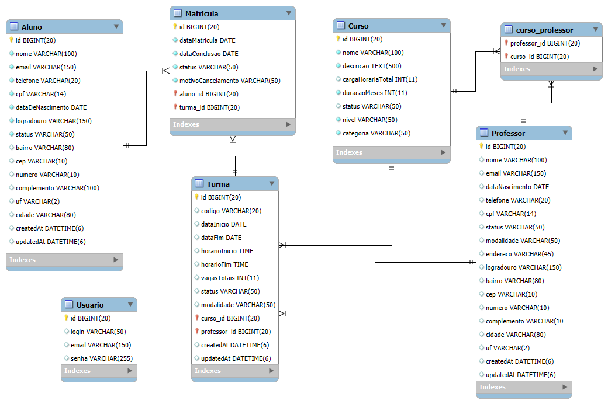

# EduTechApi - Sistema de Gestão Educacional

Uma **API REST robusta** desenvolvida em **Spring Boot** para gestão de sistemas educacionais, implementando as melhores práticas de desenvolvimento de software moderno.

## **Sobre o Projeto**

A **EduTechAPI** é uma solução de gestão educacional desenvolvida para administrar alunos, cursos, matrículas, turmas e professores de forma integrada. O projeto adota princípios **Domain-Driven Design (DDD)**, garantindo alta coesão no domínio e baixo acoplamento entre camadas.

Sua estrutura em camadas — apresentação (controllers), domínio (entidades, agregados, value objects) e infraestrutura (segurança, configuração e persistência) — promove clareza, testabilidade e manutenção facilitada.

O sistema foi construído com foco em **escalabilidade**, **segurança** e **boas práticas** de engenharia de software (SOLID, separação de responsabilidades e uso de DTOs), possibilitando evolução contínua e integração com diferentes contextos de negócio.

##  **Tecnologias Utilizadas**

### **Backend Framework**
- **Spring Boot 3.x** - Framework principal para desenvolvimento Java
- **Spring Security** - Autenticação e autorização
- **Spring Data JPA** - Abstração de acesso a dados
- **Hibernate** - ORM (Object-Relational Mapping)

### **Segurança & Autenticação**
- **JWT (JSON Web Token)** - Autenticação stateless
- **Spring Security** - Controle de acesso e autorização

### **Persistência de Dados**
- **JPA (Java Persistence API)** - Especificação de persistência
- **Hibernate** - Implementação JPA
- **H2 Database** - Banco em memória para desenvolvimento
- **PostgreSQL** - Banco de dados relacional para produção
- **MySQL** - Suporte para produção
- **pgAdmin** - Interface gráfica para administração do PostgreSQL

### **Mapeamento & Utilitários**
- **MapStruct** - Mapeamento automático entre DTOs e Entities
- **Lombok** - Redução de boilerplate code
- **Maven** - Gerenciamento de dependências e build

### **Qualidade de Código & Testes**
- **Clean Code** - Código limpo e legível
- **SOLID Principles** - Princípios de desenvolvimento
- **DDD (Domain-Driven Design)** - Arquitetura orientada ao domínio
- **JUnit 5** - Framework de testes unitários
- **Mockito** - Mock objects para testes isolados
- **JaCoCo** - Cobertura de código e relatórios

##  **Arquitetura**

O projeto segue os princípios do **Domain-Driven Design (DDD)** com separação clara de responsabilidades:

```
📁 src/main/java/com/edutech/api/
├── 📁 controller/           # Camada de Apresentação
│   ├── AlunoController      # REST API para gestão de alunos
│   ├── AuthController       # Autenticação e autorização
│   ├── CursoController      # Gestão de cursos
│   ├── MatriculaController  # Sistema de matrículas
│   ├── ProfessorController  # Gestão de professores
│   └── TurmaController      # Administração de turmas
│
├── 📁 domain/               # Camada de Domínio
│   ├── aluno/              # Agregado Aluno
│   ├── curso/              # Agregado Curso  
│   ├── endereco/           # Value Object Endereço
│   ├── enums/              # Enumerações do domínio
│   ├── exception/          # Exceções de domínio
│   ├── matricula/          # Agregado Matrícula
│   ├── professor/          # Agregado Professor
│   ├── turma/              # Agregado Turma
│   └── usuario/            # Agregado Usuário
│
└── 📁 infra/               # Camada de Infraestrutura
    ├── config/             # Configurações (Security, JWT, Beans)
    ├── dto/                # Data Transfer Objects
    ├── exception/          # Tratamento global de exceções
    └── security/           # Configurações de segurança
```
## Diagrama do Modelo Físico



## Deploy

**Acesso Online**

A aplicação foi implantada na plataforma de nuvem **Render** utilizando banco de dados **H2** (migrado do PostgreSQL para deployment gratuito) através da imagem Docker **lucher/edutech-api-deploy**.

Devido à migração para H2, foi necessário criar endpoints específicos, já que o DataLoader não carrega automaticamente neste ambiente. O restante do código permanece idêntico ao projeto principal:
- Registro: https://edutech-api-deploy.onrender.com/auth/registrar
- Login: https://edutech-api-deploy.onrender.com/auth/login

A aplicação está disponível em: https://edutech-api-deploy.onrender.com

### Autenticação JWT
Para acessar os endpoints protegidos, você precisa obter um token JWT fazendo login:

#### 1. Registro de Usuário
```
POST https://edutech-api-deploy.onrender.com/auth/registrar
```

**Exemplo de JSON:**
```json
{
    "login": "user",
    "senha": "senha"
}
```
#### 2. Login
   Após o registro, faça login usando as mesmas credenciais:
```
POST https://edutech-api-deploy.onrender.com/auth/login
```
**JSON para envio:**
```json
{
    "login": "user",
    "senha": "senha"
}
```

**Resposta esperada:**
```json
{
  "token": "eyJhbGciOiJSUzI1NiJ9.eyJpc3MiOiJ..."
}
```

#### 3. Usando o Token
   Inclua o token no header Authorization das suas requisições:
Após obter o token, inclua-o no header Authorization das suas requisições:

```
Authorization: Bearer SEU_TOKEN_AQUI
```

## **Containerização**

### Executar localmente
Para rodar a aplicação localmente, use os seguintes comandos:

```bash
docker pull lucher/edutech-api
```
```bash
docker run -p 8080:8080 lucher/edutech-api
```
Após iniciar o contêiner, você pode acessar o H2 Console em http://localhost:8080/h2-console com as seguintes credenciais:

- **JDBC URL:** `jdbc:h2:mem:edutechdb`
- **User Name:** `sa`
- **Password:** <i>`(deixe em branco)`</i>

## **Boas Práticas Implementadas**

- **RESTful API** com status codes apropriados
- **Validação de dados** com Bean Validation
- **Tratamento global de exceções**
- **Logging estruturado** com níveis configuráveis
- **Documentação automática** com Swagger/OpenAPI
- **JavaDoc** para documentação de código
- **Separação de responsabilidades** (Controller → Service → Repository)
- **DTOs para input/output** evitando exposição de entidades
- **Mapeamento automático** com MapStruct para performance
- **Testes unitários completos** com JUnit 5 e Mockito
- **Cobertura de código** monitorada com JaCoCo

## **Padrões de Desenvolvimento**

### **Clean Code**
- Nomes descritivos e significativos
- Funções pequenas e focadas
- Comentários apenas quando necessário
- Formatação consistente

### **SOLID Principles**
- **S**ingle Responsibility Principle
- **O**pen/Closed Principle  
- **L**iskov Substitution Principle
- **I**nterface Segregation Principle
- **D**ependency Inversion Principle

### **DDD (Domain-Driven Design)**
- Modelagem rica do domínio
- Separação clara entre camadas
- Linguagem ubíqua
- Bounded contexts bem definidos

  ## Principais Endpoints

### Autenticação
| Método | Endpoint                    | Descrição                |
|--------|-----------------------------|--------------------------|
| POST    | `http://localhost:8080/login` | Autentica usuario e senha retornando token JWT |

### Alunos

| Método | Endpoint                    | Descrição                |
|--------|-----------------------------|--------------------------|
| POST    | `http://localhost:8080/alunos` | Cadastra um novo aluno. |
| PATCH    | `http://localhost:8080/alunos/{id}` | Atualiza um aluno existente. |
| GET   | `http://localhost:8080/alunos/{id}` | Busca aluno por ID. |
| GET    | `http://localhost:8080/alunos/{id}` | Busca alunos pelo nome. |
| GET | `http://localhost:8080/alunos/nome` | Busca alunos por status.     |
| GET | `http://localhost:8080/alunos/status` | Lista todos os alunos.     |
| GET | `http://localhost:8080/alunos/detalhes` | Detalha aluno por ID.     |
| DELETE | `http://localhost:8080/alunos/{id}` | Inativa um aluno.     |

### Professores
| Método | Endpoint                    | Descrição                |
|--------|-----------------------------|--------------------------|
| POST    | `http://localhost:8080/professores` | Cadastra novo professor. |
| PATCH    | `http://localhost:8080/professores/{id}` | Atualiza dados do professor. |
| GET   | `http://localhost:8080/professores/{id}` | Busca professor por ID. |
| GET    | `http://localhost:8080/professores/buscar` | Busca professores por nome. |
| GET | `http://localhost:8080/professores/modalidade` | Busca professores por modalidade.     |
| GET | `http://localhost:8080/professores` | Lista todos os professores.     |
| GET | `http://localhost:8080/professores/{id}/detalhes` | Detalha professor.     |
| DELETE | `http://localhost:8080/professores/{id}` | Inativa professor.     |

### Cursos
| Método | Endpoint                    | Descrição                |
|--------|-----------------------------|--------------------------|
| POST    | `http://localhost:8080/cursos` | Cadastra novo curso.   |
| PATCH    | `http://localhost:8080/cursos/{id}` | Atualiza curso existente. |
| GET   | `http://localhost:8080/cursos` | Lista todos os cursos. |
| GET    | `http://localhost:8080/cursos/{id}` | Busca curso por ID. |
| GET    | `http://localhost:8080/cursos/{id}/detalhes` | Detalha curso por ID. |
| GET    | `http://localhost:8080/cursos/buscar-por-carga-horaria` | Busca cursos por faixa de carga horaria. |
| GET    | `http://localhost:8080/cursos/buscar-por-nivel` | Busca cursos por nível. |
| GET    | `http://localhost:8080/cursos/buscar-por-nome` | Busca curso por nome exato. |
| PUT    | `http://localhost:8080/cursos/{id}/ativar` | Ativa curso. |
| PUT    | `http://localhost:8080/cursos/{id}/inativar` | Inativa curso. |
| PUT    | `http://localhost:8080/cursos/{cursoId}/professor/{professorId}` | Vincula professor ao curso. |
| DELETE    | `http://localhost:8080/cursos/{cursoId}/professor/{professorId}` | Desvincula professor do curso. |
| GET    | `http://localhost:8080/cursos/professor/{professorId}` | Lista cursos do professor. |

### Matriculas
| Método | Endpoint                    | Descrição                |
|--------|-----------------------------|--------------------------|
| POST    | `http://localhost:8080/alunos` | Cadastra nova matricula. |
| GET    | `http://localhost:8080/alunos/{id}` | Detalha matricula por ID. |
| GET   | `http://localhost:8080/alunos/buscar-por-nome` | Busca matriculas por nome do aluno. |
| GET    | `http://localhost:8080/alunos` | Lista todas as matriculas. |
| PUT | `http://localhost:8080/alunos/{id}/concluir` | Conclui matricula.     |
| PUT | `http://localhost:8080/alunos/{id}/trancar` | Tranca a matricula.     |
| PUT | `http://localhost:8080/alunos/{id}/reativar` | Reativa matricula.     |
| PUT | `http://localhost:8080/alunos/{id}/cancelar` | Cancela matricula.     |

### Turmas
| Método | Endpoint                    | Descrição                |
|--------|-----------------------------|--------------------------|
| POST   | `http://localhost:8080/turmas` | Cadastra nova turma. |
| PATCH  | `http://localhost:8080/turmas/{id}` | Atualiza turma. |
| GET    | `http://localhost:8080/turmas/{id}` | Detalha turma por ID. |
| GET    | `http://localhost:8080/turmas/codigo` | Busca turma por código. |
| GET    | `http://localhost:8080/turmas` | Lista todas as turmas.     |
| PUT    | `http://localhost:8080/turmas/{turmaId}/iniciar` | Inicia turma.     |
| PUT     | `http://localhost:8080/turmas/{turmaId}/concluir` | Conclui turma.     |
| DELETE | `http://localhost:8080/turmas/{id}/cancelamento` | Cancela turma.     |
| PUT    | `http://localhost:8080/turmas/{id}/professor/{professorId}` | Vincula professor a turma.     |
| DELETE | `http://localhost:8080/turmas/{id}/professor/{professorId}` | Desvincula professor a turma.     |
| PUT    | `http://localhost:8080/turmas/{id}/curso/{cursoId}` | Vincula curso a turma.     |
| DELETE | `http://localhost:8080/turmas/{id}/curso/{cursoId}` | Desvincula curso a turma.     |

##  **Como Executar**

### **Pré-requisitos**
- Java 21+
- Maven 3.8+
- Docker 

### **Executar Localmente**
```bash
git clone https://github.com/luchersou/edutech-course-management.git
```
```bash
cd edutech-course-management
```
```bash
./mvnw spring-boot:run
```

### **Acessar**
- **API**: http://localhost:8080
- **Swagger UI**: http://localhost:8080/swagger-ui.html

---

**Desenvolvido por [Lucas Herzinger Souza](https://github.com/luchersou)**

*Este projeto demonstra proficiência em Spring Boot, arquitetura limpa e melhores práticas de desenvolvimento Java empresarial.*
